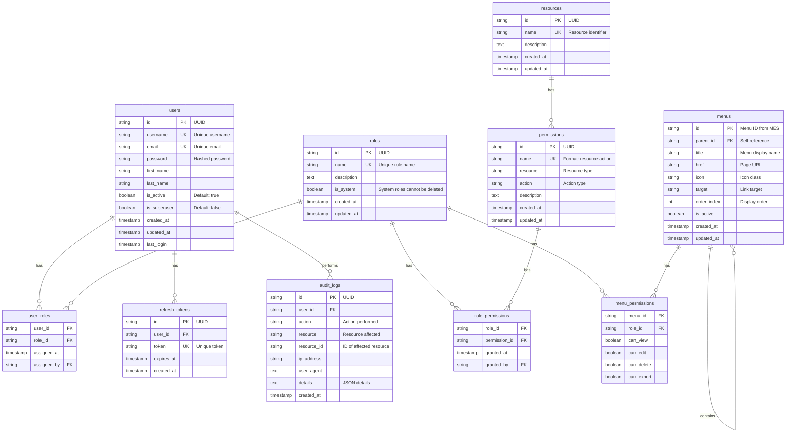

# RBAC System Database Schema

## Overview
This document provides detailed database schema design for the RBAC (Role-Based Access Control) system tailored for Manufacturing Execution Systems (MES).

## Database Configuration
- **Engine**: MySQL 8.0
- **Character Set**: utf8mb4
- **Collation**: utf8mb4_unicode_ci
- **Storage Engine**: InnoDB

## Schema Diagram



## Table Definitions

### 1. Core Tables

#### users
Stores system user accounts.

```sql
CREATE TABLE `users` (
    `id` CHAR(36) NOT NULL DEFAULT (UUID()),
    `username` VARCHAR(50) NOT NULL,
    `email` VARCHAR(100) NOT NULL,
    `password` VARCHAR(255) NOT NULL,
    `first_name` VARCHAR(50),
    `last_name` VARCHAR(50),
    `is_active` BOOLEAN DEFAULT TRUE,
    `is_superuser` BOOLEAN DEFAULT FALSE,
    `created_at` TIMESTAMP DEFAULT CURRENT_TIMESTAMP,
    `updated_at` TIMESTAMP DEFAULT CURRENT_TIMESTAMP ON UPDATE CURRENT_TIMESTAMP,
    `last_login` TIMESTAMP NULL,
    PRIMARY KEY (`id`),
    UNIQUE KEY `uk_username` (`username`),
    UNIQUE KEY `uk_email` (`email`),
    INDEX `idx_is_active` (`is_active`),
    INDEX `idx_created_at` (`created_at`)
) ENGINE=InnoDB DEFAULT CHARSET=utf8mb4 COLLATE=utf8mb4_unicode_ci;
```

#### roles
Defines roles that can be assigned to users.

```sql
CREATE TABLE `roles` (
    `id` CHAR(36) NOT NULL DEFAULT (UUID()),
    `name` VARCHAR(50) NOT NULL,
    `description` TEXT,
    `is_system` BOOLEAN DEFAULT FALSE COMMENT 'System roles cannot be deleted',
    `created_at` TIMESTAMP DEFAULT CURRENT_TIMESTAMP,
    `updated_at` TIMESTAMP DEFAULT CURRENT_TIMESTAMP ON UPDATE CURRENT_TIMESTAMP,
    PRIMARY KEY (`id`),
    UNIQUE KEY `uk_name` (`name`),
    INDEX `idx_is_system` (`is_system`)
) ENGINE=InnoDB DEFAULT CHARSET=utf8mb4 COLLATE=utf8mb4_unicode_ci;
```

#### permissions
Defines granular permissions following the pattern: resource:action.

```sql
CREATE TABLE `permissions` (
    `id` CHAR(36) NOT NULL DEFAULT (UUID()),
    `name` VARCHAR(100) NOT NULL COMMENT 'Format: resource:action',
    `resource` VARCHAR(50) NOT NULL,
    `action` VARCHAR(50) NOT NULL,
    `description` TEXT,
    `created_at` TIMESTAMP DEFAULT CURRENT_TIMESTAMP,
    `updated_at` TIMESTAMP DEFAULT CURRENT_TIMESTAMP ON UPDATE CURRENT_TIMESTAMP,
    PRIMARY KEY (`id`),
    UNIQUE KEY `uk_name` (`name`),
    INDEX `idx_resource_action` (`resource`, `action`)
) ENGINE=InnoDB DEFAULT CHARSET=utf8mb4 COLLATE=utf8mb4_unicode_ci;
```

#### resources
Defines protected resources in the system.

```sql
CREATE TABLE `resources` (
    `id` CHAR(36) NOT NULL DEFAULT (UUID()),
    `name` VARCHAR(50) NOT NULL,
    `description` TEXT,
    `created_at` TIMESTAMP DEFAULT CURRENT_TIMESTAMP,
    `updated_at` TIMESTAMP DEFAULT CURRENT_TIMESTAMP ON UPDATE CURRENT_TIMESTAMP,
    PRIMARY KEY (`id`),
    UNIQUE KEY `uk_name` (`name`)
) ENGINE=InnoDB DEFAULT CHARSET=utf8mb4 COLLATE=utf8mb4_unicode_ci;
```

#### menus
Stores the hierarchical menu structure from MES.

```sql
CREATE TABLE `menus` (
    `id` VARCHAR(10) NOT NULL COMMENT 'Menu ID from MES JSON',
    `parent_id` VARCHAR(10) NULL,
    `title` VARCHAR(100) NOT NULL,
    `href` VARCHAR(255),
    `icon` VARCHAR(50),
    `target` VARCHAR(20) DEFAULT '_self',
    `order_index` INT DEFAULT 0,
    `is_active` BOOLEAN DEFAULT TRUE,
    `created_at` TIMESTAMP DEFAULT CURRENT_TIMESTAMP,
    `updated_at` TIMESTAMP DEFAULT CURRENT_TIMESTAMP ON UPDATE CURRENT_TIMESTAMP,
    PRIMARY KEY (`id`),
    INDEX `idx_parent_id` (`parent_id`),
    INDEX `idx_is_active` (`is_active`),
    INDEX `idx_order_index` (`order_index`),
    CONSTRAINT `fk_menu_parent` FOREIGN KEY (`parent_id`) 
        REFERENCES `menus`(`id`) ON DELETE CASCADE
) ENGINE=InnoDB DEFAULT CHARSET=utf8mb4 COLLATE=utf8mb4_unicode_ci;
```

### 2. Relationship Tables

#### user_roles
Many-to-many relationship between users and roles.

```sql
CREATE TABLE `user_roles` (
    `user_id` CHAR(36) NOT NULL,
    `role_id` CHAR(36) NOT NULL,
    `assigned_at` TIMESTAMP DEFAULT CURRENT_TIMESTAMP,
    `assigned_by` CHAR(36),
    PRIMARY KEY (`user_id`, `role_id`),
    INDEX `idx_user_id` (`user_id`),
    INDEX `idx_role_id` (`role_id`),
    INDEX `idx_assigned_at` (`assigned_at`),
    CONSTRAINT `fk_user_roles_user` FOREIGN KEY (`user_id`) 
        REFERENCES `users`(`id`) ON DELETE CASCADE,
    CONSTRAINT `fk_user_roles_role` FOREIGN KEY (`role_id`) 
        REFERENCES `roles`(`id`) ON DELETE CASCADE,
    CONSTRAINT `fk_user_roles_assigned_by` FOREIGN KEY (`assigned_by`) 
        REFERENCES `users`(`id`) ON DELETE SET NULL
) ENGINE=InnoDB DEFAULT CHARSET=utf8mb4 COLLATE=utf8mb4_unicode_ci;
```

#### role_permissions
Many-to-many relationship between roles and permissions.

```sql
CREATE TABLE `role_permissions` (
    `role_id` CHAR(36) NOT NULL,
    `permission_id` CHAR(36) NOT NULL,
    `granted_at` TIMESTAMP DEFAULT CURRENT_TIMESTAMP,
    `granted_by` CHAR(36),
    PRIMARY KEY (`role_id`, `permission_id`),
    INDEX `idx_role_id` (`role_id`),
    INDEX `idx_permission_id` (`permission_id`),
    CONSTRAINT `fk_role_permissions_role` FOREIGN KEY (`role_id`) 
        REFERENCES `roles`(`id`) ON DELETE CASCADE,
    CONSTRAINT `fk_role_permissions_permission` FOREIGN KEY (`permission_id`) 
        REFERENCES `permissions`(`id`) ON DELETE CASCADE,
    CONSTRAINT `fk_role_permissions_granted_by` FOREIGN KEY (`granted_by`) 
        REFERENCES `users`(`id`) ON DELETE SET NULL
) ENGINE=InnoDB DEFAULT CHARSET=utf8mb4 COLLATE=utf8mb4_unicode_ci;
```

#### menu_permissions
Defines menu-specific permissions for roles.

```sql
CREATE TABLE `menu_permissions` (
    `menu_id` VARCHAR(10) NOT NULL,
    `role_id` CHAR(36) NOT NULL,
    `can_view` BOOLEAN DEFAULT FALSE,
    `can_edit` BOOLEAN DEFAULT FALSE,
    `can_delete` BOOLEAN DEFAULT FALSE,
    `can_export` BOOLEAN DEFAULT FALSE,
    PRIMARY KEY (`menu_id`, `role_id`),
    INDEX `idx_menu_id` (`menu_id`),
    INDEX `idx_role_id` (`role_id`),
    CONSTRAINT `fk_menu_permissions_menu` FOREIGN KEY (`menu_id`) 
        REFERENCES `menus`(`id`) ON DELETE CASCADE,
    CONSTRAINT `fk_menu_permissions_role` FOREIGN KEY (`role_id`) 
        REFERENCES `roles`(`id`) ON DELETE CASCADE
) ENGINE=InnoDB DEFAULT CHARSET=utf8mb4 COLLATE=utf8mb4_unicode_ci;
```

### 3. Security Tables

#### refresh_tokens
Stores refresh tokens for JWT authentication.

```sql
CREATE TABLE `refresh_tokens` (
    `id` CHAR(36) NOT NULL DEFAULT (UUID()),
    `user_id` CHAR(36) NOT NULL,
    `token` VARCHAR(500) NOT NULL,
    `expires_at` TIMESTAMP NOT NULL,
    `created_at` TIMESTAMP DEFAULT CURRENT_TIMESTAMP,
    PRIMARY KEY (`id`),
    UNIQUE KEY `uk_token` (`token`),
    INDEX `idx_user_id` (`user_id`),
    INDEX `idx_expires_at` (`expires_at`),
    CONSTRAINT `fk_refresh_tokens_user` FOREIGN KEY (`user_id`) 
        REFERENCES `users`(`id`) ON DELETE CASCADE
) ENGINE=InnoDB DEFAULT CHARSET=utf8mb4 COLLATE=utf8mb4_unicode_ci;
```

#### audit_logs
Tracks all important system activities.

```sql
CREATE TABLE `audit_logs` (
    `id` CHAR(36) NOT NULL DEFAULT (UUID()),
    `user_id` CHAR(36),
    `action` VARCHAR(100) NOT NULL,
    `resource` VARCHAR(50),
    `resource_id` VARCHAR(36),
    `ip_address` VARCHAR(45),
    `user_agent` TEXT,
    `details` JSON,
    `created_at` TIMESTAMP DEFAULT CURRENT_TIMESTAMP,
    PRIMARY KEY (`id`),
    INDEX `idx_user_id` (`user_id`),
    INDEX `idx_action` (`action`),
    INDEX `idx_resource` (`resource`, `resource_id`),
    INDEX `idx_created_at` (`created_at`),
    CONSTRAINT `fk_audit_logs_user` FOREIGN KEY (`user_id`) 
        REFERENCES `users`(`id`) ON DELETE SET NULL
) ENGINE=InnoDB DEFAULT CHARSET=utf8mb4 COLLATE=utf8mb4_unicode_ci;
```

## Indexes Strategy

### Performance Indexes
1. **User lookups**: Username, email, active status
2. **Role lookups**: Name, system flag
3. **Permission lookups**: Name, resource-action combination
4. **Menu navigation**: Parent ID, active status, order
5. **Audit trails**: User, action, timestamp

### Foreign Key Indexes
All foreign keys have corresponding indexes for optimal JOIN performance.

## Data Types and Constraints

### UUID Generation
- All primary keys use UUID v4
- Generated at database level using `DEFAULT (UUID())`

### Timestamps
- `created_at`: Set on INSERT
- `updated_at`: Updated on every UPDATE
- Using `ON UPDATE CURRENT_TIMESTAMP`

### String Lengths
- Username: 50 characters
- Email: 100 characters
- Password: 255 characters (for bcrypt hash)
- Permission name: 100 characters
- Resource/Action: 50 characters each

## Sample Data

### Default Roles
```sql
INSERT INTO `roles` (`name`, `description`, `is_system`) VALUES
('super_admin', '超级管理员 - 拥有所有权限', TRUE),
('production_manager', '生产经理 - 管理生产相关功能', FALSE),
('quality_inspector', '质检员 - 管理质量相关功能', FALSE),
('operator', '操作员 - 基础操作权限', FALSE),
('viewer', '查看者 - 只读权限', FALSE);
```

### Default Resources
```sql
INSERT INTO `resources` (`name`, `description`) VALUES
('user', '用户管理'),
('role', '角色管理'),
('permission', '权限管理'),
('menu', '菜单管理'),
('production', '生产管理'),
('quality', '质量管理'),
('report', '报表管理'),
('system', '系统管理');
```

### Default Permissions
```sql
INSERT INTO `permissions` (`name`, `resource`, `action`, `description`) VALUES
-- User permissions
('user:create', 'user', 'create', '创建用户'),
('user:read', 'user', 'read', '查看用户'),
('user:update', 'user', 'update', '更新用户'),
('user:delete', 'user', 'delete', '删除用户'),
-- Role permissions
('role:create', 'role', 'create', '创建角色'),
('role:read', 'role', 'read', '查看角色'),
('role:update', 'role', 'update', '更新角色'),
('role:delete', 'role', 'delete', '删除角色'),
-- Production permissions
('production:view', 'production', 'view', '查看生产数据'),
('production:create_work_order', 'production', 'create_work_order', '创建工单'),
('production:update_work_order', 'production', 'update_work_order', '更新工单'),
-- Quality permissions
('quality:view', 'quality', 'view', '查看质量数据'),
('quality:manage_defects', 'quality', 'manage_defects', '管理缺陷'),
-- Report permissions
('report:view', 'report', 'view', '查看报表'),
('report:export', 'report', 'export', '导出报表');
```

## Migration Scripts

### Create Database
```sql
CREATE DATABASE IF NOT EXISTS `rbac_system` 
DEFAULT CHARACTER SET utf8mb4 
DEFAULT COLLATE utf8mb4_unicode_ci;

USE `rbac_system`;
```

### Drop Tables (for reset)
```sql
SET FOREIGN_KEY_CHECKS = 0;
DROP TABLE IF EXISTS `audit_logs`;
DROP TABLE IF EXISTS `refresh_tokens`;
DROP TABLE IF EXISTS `menu_permissions`;
DROP TABLE IF EXISTS `role_permissions`;
DROP TABLE IF EXISTS `user_roles`;
DROP TABLE IF EXISTS `menus`;
DROP TABLE IF EXISTS `resources`;
DROP TABLE IF EXISTS `permissions`;
DROP TABLE IF EXISTS `roles`;
DROP TABLE IF EXISTS `users`;
SET FOREIGN_KEY_CHECKS = 1;
```

## Performance Considerations

### Query Optimization
1. Use covering indexes for frequently accessed columns
2. Partition audit_logs table by month for large datasets
3. Archive old audit logs periodically

### Caching Strategy
1. Cache user permissions in Redis
2. Cache menu structure per role
3. Invalidate cache on permission changes

### Connection Pooling
```javascript
// Recommended pool configuration
{
    connectionLimit: 10,
    waitForConnections: true,
    queueLimit: 0,
    enableKeepAlive: true,
    keepAliveInitialDelay: 0
}
```

## Maintenance

### Regular Tasks
1. **Daily**: Backup database
2. **Weekly**: Analyze table statistics
3. **Monthly**: Archive old audit logs
4. **Quarterly**: Review and optimize indexes

### Monitoring Queries
```sql
-- Check table sizes
SELECT 
    table_name AS `Table`,
    ROUND(((data_length + index_length) / 1024 / 1024), 2) AS `Size (MB)`
FROM information_schema.TABLES
WHERE table_schema = 'rbac_system'
ORDER BY (data_length + index_length) DESC;

-- Check slow queries
SELECT * FROM mysql.slow_log
WHERE db = 'rbac_system'
ORDER BY start_time DESC
LIMIT 10;

-- Check active connections
SHOW PROCESSLIST;
```

## Security Notes

1. **Encryption**: Consider encrypting sensitive columns at rest
2. **Auditing**: Enable MySQL binary logging
3. **Access Control**: Use separate MySQL users for app and admin
4. **Backup**: Implement automated encrypted backups
5. **Monitoring**: Set up alerts for suspicious activities

---

Document Version: 1.0
Last Updated: 2024-01-01
Author: RBAC System Team